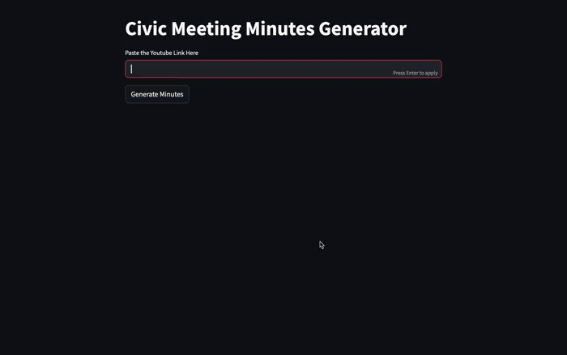

## 📝 Meeting Minutes Generator

This project automates the creation of structured meeting minutes for government commission meetings. It leverages the Google Gemini API to extract relevant content, uses Pydantic to validate and structure the data, and Jinja2 templates to convert the output into an HTML summary. The result is a fully automated, end-to-end pipeline that reliably generates a solid first draft of minutes for city commission meetings.  

---

## Demo



## Tech Stack

- **FastAPI** – Backend routes and request handling  
- **Gemini API** – Meeting summarization  
- **yt-dlp** – Audio extraction from YouTube  
- **Pydantic** – Data validation (Meeting Minutes Structure)
- **Jinja2** – Templated HTML output  
- **Streamlit** (optional) – Demo interface  
- **AI Tools** – Used to generate initial HTML templates and troubleshoot issues

---

## Setup 

1. Clone the repository:
```
  git clone https://github.com/austin-compton5/Ai-Powered-Minutes-Generator
  cd your-repo-name
```
2: Set up your python environment:
```
  python3 -m venv venv
  source venv/bin/activate
  pip install -r requirements.txt
```
3. Create a .env file in the root directory with your Gemini API key
```
  GOOGLE_API_KEY=your_google_api_key
```

5. Run the Streamlit demo
```
 streamlit run src/streamlit_app/app.py 
```

6. Or run the API
```
cd src/api
uvicorn main:app --reload 
```
---
### API Example

**Endpoint:**  
`POST /generate`

**Request Body:**
```json
{
  "youtube_link": "https://www.youtube.com/watch?v=dQw4w9WgXcQ",
  "selected_template": "city_commission_model"
}
```
**Response:**
```json
{
  "html": "<html><head>...</head><body><h1>Meeting Minutes</h1>...</body></html>"
}
```
--- 
## Project Lineage & Acknowledgements

This project was adapted from an open-source financial data extraction app. While the original use case was unrelated (market data), its structure helped accelerate development.

Changes and additions made:

* Swapped in a new data source (YouTube commission meeting audio)
* Designed custom Pydantic models for structured meeting content
* Implemented a Jinja2-based HTML rendering system
* Integrated Google Gemini for NLP-based content extraction

Original repo: hackingthemarkets/gemini-multimodal-structured-extraction

Huge thanks to the original developer — I learned a lot building on top of their work.

